<div align="center">


# 🎬 AI Video Assistant

### *Transcribe · Summarise · Extract · Chat*

**Turn any video or meeting recording into structured intelligence — in minutes.**

</div>

---

## 📌 Problem Statement

Every day, hours of valuable content get locked inside videos, meeting recordings, and lectures — completely unsearchable and hard to review.

**The core problems:**

- 🕐 **Time** — Rewatching a 1-hour meeting to find one decision wastes everyone's time
- 🌐 **Language barrier** — Most AI tools only work well with English content
- 🔍 **No searchability** — You can't "ctrl+F" a video
- 📋 **Manual effort** — Writing summaries, action items, and notes by hand after every meeting
- 💬 **No interactivity** — You can't ask a video a question

**AI Video Assistant solves all of this** — give it a YouTube URL or upload a file, and it handles the rest automatically.

---

## 💡 Approach

The solution is built as a **multi-stage AI pipeline**, where each stage specialises in one job:

### Stage 1 — Audio Extraction
Raw video/audio is downloaded (via `yt-dlp` for YouTube) or uploaded directly, then converted to a consistent 16kHz mono WAV format and split into 10-minute chunks for parallel processing.

### Stage 2 — Dual-Engine Transcription
- **English** → OpenAI Whisper (runs fully locally, no API cost)
- **Telugu, Hindi, Kannada, Tamil** → Sarvam AI's `saaras:v2.5` model, with a 1-second sliding window overlap to prevent words getting cut at chunk boundaries

### Stage 3 — Map-Reduce Summarisation
Long transcripts are too big for a single LLM call. The approach:
1. Split transcript into 3000-character chunks
2. Summarise each chunk independently (map)
3. Combine all partial summaries into one final summary (reduce)

This handles videos of any length without hitting context limits.

### Stage 4 — Parallel Extraction
Three specialised prompts extract independently:
- ✅ **Action items** — with owner and deadline
- 🔑 **Key decisions** — what was agreed
- ❓ **Open questions** — unresolved topics needing follow-up

### Stage 5 — RAG (Retrieval-Augmented Generation)
The transcript is chunked, embedded using `all-MiniLM-L6-v2`, and stored in ChromaDB. When a user asks a question, the top-5 most relevant chunks are retrieved and passed to Mistral AI — so aanswers are grounded in retrieved transcript context to reduce hallucinations

### Stage 6 — Persistent Session Storage
Every analysis is saved to SQLite with full chat history, so users can revisit any past session without reprocessing.

---

## 🏗️ Architecture



```
YouTube URL / Local File
        │
        ▼
[ audio_processor.py ]
  Download (yt-dlp) → Convert to WAV (pydub) → Split into 10-min chunks
        │
        ▼
[ transcriber.py ]
  English?  → Whisper (local model)
  Regional? → Sarvam AI API  (Telugu · Hindi · Kannada · Tamil)
        │
        ├─────────────────────────────────────┐
        ▼                                     ▼
[ summarizer.py ]                    [ extractor.py ]
  Map-Reduce summary                 Action items · Decisions · Questions
  (Mistral AI)                       (Mistral AI)
        │                                     │
        └──────────────┬──────────────────────┘
                       ▼
              [ Mistral AI LLM ]
              mistral-small-latest
                       │
                       ▼
           [ vector_store.py ]
           ChromaDB + MiniLM Embeddings
           chunk_size=700, overlap=100
                       │
                       ▼
            [ rag_engine.py ]
            RAG Chain · k=5 retrieval
            Chat history (last 6 turns)
                       │
               ┌───────┴───────┐
               ▼               ▼
          [ app.py ]       [ db.py ]
          Streamlit UI     SQLite Storage
          Auth · Sessions  Users · History
```

---

## 📁 Project Structure

```
ai-video-assistant/
│
├── app.py                    # Streamlit UI — main entry point
├── main.py                   # CLI entry point (no UI)
│
├── core/
│   ├── transcriber.py        # Whisper + Sarvam AI transcription engine
│   ├── summarizer.py         # Map-reduce summarisation via Mistral
│   ├── extractor.py          # Action items, decisions, questions
│   ├── rag_engine.py         # RAG chain + multi-turn chat history
│   └── vector_store.py       # ChromaDB vector store + MiniLM embeddings
│
├── utils/
│   ├── audio_processor.py    # YouTube download + WAV conversion + chunking
│   ├── auth.py               # Streamlit login & registration UI
│   └── db.py                 # SQLite — users, sessions, chat history
│
├── .env                      # API keys (never commit this!)
├── requirements.txt          # Python dependencies
└── README.md                 # You are here
```

---

## ✨ Features

| Feature | Description |
|---|---|
| 🔗 YouTube + Local file | Paste a URL or upload MP3/MP4/WAV/M4A/OGG/WebM |
| 🌐 Multi-language | English (Whisper) · Telugu, Hindi, Kannada, Tamil (Sarvam AI) |
| 📋 Smart Summarisation | Map-reduce — works on 2-hour+ recordings |
| ✅ Action Item Extraction | Who does what, by when |
| 🔑 Key Decision Extraction | Important decisions made |
| ❓ Open Question Detection | Unresolved topics for follow-up |
| 💬 RAG Chat | Ask anything — answers grounded in your transcript |
| 🧠 Chat Memory | Multi-turn context-aware conversation (last 6 turns) |
| 👤 User Auth | Secure per-user login & registration |
| 📁 Session History | Save, reload, and delete past analyses |
| 🎨 Modern Dark UI | Sleek responsive Streamlit interface |
| 🖥️ CLI Mode | Run fully from terminal with no UI |

---

## 🧠 Tech Stack

| Layer | Technology | Purpose |
|---|---|---|
| UI | Streamlit | Web interface |
| LLM | Mistral AI `mistral-small-latest` | Summarisation, extraction, RAG answers |
| Transcription (EN) | OpenAI Whisper `small` | Local offline transcription |
| Transcription (IN) | Sarvam AI `saaras:v2.5` | Indian language STT + translation |
| Embeddings | `all-MiniLM-L6-v2` (HuggingFace) | Semantic vector embeddings |
| Vector Store | ChromaDB | Similarity search for RAG |
| RAG Framework | LangChain + LCEL | Retrieval pipelines, prompt orchestration, conversational RAG |
| Audio Processing | pydub + ffmpeg | Format conversion, chunking |
| YouTube Download | yt-dlp | Audio extraction from YouTube |
| Database | SQLite | User accounts, sessions, chat history |
| Auth | bcrypt + SQLite | Secure password hashing & session storage |

---

## 🚀 Getting Started

### Prerequisites

- Python 3.10+
- `ffmpeg` installed on your system:
  - **Mac:** `brew install ffmpeg`
  - **Ubuntu:** `sudo apt install ffmpeg`
  - **Windows:** [ffmpeg.org/download](https://ffmpeg.org/download.html)

### 1. Clone the repository

```bash
git clone https://github.com/Sushpal/ai-video-assistant.git
cd ai-video-assistant
```

### 2. Create a virtual environment

```bash
python -m venv venv
source venv/bin/activate        # Mac/Linux
venv\Scripts\activate           # Windows
```

### 3. Install dependencies

```bash
pip install -r requirements.txt
```

### 4. Set up your `.env` file

```env
MISTRAL_API_KEY=your_mistral_api_key_here
SARVAM_API_KEY=your_sarvam_api_key_here       # Only needed for Indian languages
WHISPER_MODEL=small                            # tiny · base · small · medium · large
```

**Get your API keys:**
- Mistral AI → [console.mistral.ai](https://console.mistral.ai)
- Sarvam AI → [dashboard.sarvam.ai](https://dashboard.sarvam.ai)

### 5. Run the app

```bash
streamlit run app.py
```

Open your browser at `http://localhost:8501` 🎉

---

## 💻 CLI Usage

Prefer the terminal? Use `main.py` directly:

```bash
python main.py
```

```
Enter YouTube URL or local file path: https://youtube.com/watch?v=...
Language (english/hinglish): english

============================================================
📌 Title: Q3 Planning Meeting — Product Roadmap Review
📋 Summary:
  • Team aligned on Q3 priorities...
✅ Action Items:
  1. Ravi — finalize API specs by Friday
  ...
🔑 Key Decisions:
  1. Launch date moved to October 15
  ...
❓ Open Questions:
  1. Budget approval still pending from finance
============================================================

💬 Chat with your meeting (type 'exit' to quit)

You: What did we decide about the launch date?
🤖 Assistant: The team decided to move the launch date to October 15...
```

---

## 🌐 Supported Languages

| Language | Engine | API Required |
|---|---|---|
| English | OpenAI Whisper (local) | ❌ No |
| Telugu | Sarvam AI `saaras:v2.5` | ✅ `SARVAM_API_KEY` |
| Hindi | Sarvam AI | ✅ `SARVAM_API_KEY` |
| Kannada | Sarvam AI | ✅ `SARVAM_API_KEY` |
| Tamil | Sarvam AI | ✅ `SARVAM_API_KEY` |

---

## 🔒 Security Notes

- Passwords are hashed with SHA-256 — never stored as plain text
- API keys loaded from `.env` — never hardcode or commit them
- Each user can only access their own sessions — enforced at the DB query level
- Uploaded temp files are deleted immediately after processing
- Username whitespace is stripped on input to prevent ghost accounts

---

## 🐛 Known Limitations

- Very fast speech near Sarvam chunk boundaries may occasionally miss a syllable despite the 1-second overlap window
- Sarvam AI free tier has rate limits — large files may need retries
- ChromaDB is stored locally in `vector_db/` — not suitable for multi-server deployments without a shared volume
- Whisper `small` model trades some accuracy for speed — use `medium` or `large` for better results on noisy audio

---

## 🗺️ Roadmap

- [ ] Export session as PDF report
- [ ] Speaker diarisation (who said what)
- [ ] Timestamp-based transcript navigation
- [ ] More language support
- [ ] Google Drive / Notion export
- [ ] Docker deployment
- [ ] Streaming AI responses
- [ ] Batch processing — multiple videos in one run
---

## 🤝 Contact

For suggestions, feedback, or collaboration:

- GitHub: https://github.com/Sushpal
- Email: nenavathsushpal4@gmail.com
---


---

<div align="center">

**Built by Sushpal**


<sub>Powered by Mistral AI · OpenAI Whisper · Sarvam AI · ChromaDB · LangChain · Streamlit</sub>

</div>